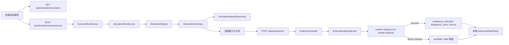

# 技术架构说明

## 模块结构

后端：

- **Controller 层**：运行、报告、优化、场景模型、分析五类入口分开承载，URL 保持 `/api/simulation/**` 和 `/api/analysis/**`。
- **Scenario 层**：`ScenarioPresetCatalog` 提供权威预设模型，`ScenarioRunService` 负责批量运行和对比摘要。
- **Simulation 层**：`SimulationEngine` 负责事件调度，随机采样、学生画像、窗口选择、不变量校验、快照记录已拆到独立类。
- **Report 层**：`SimulationReportRepository` 负责文件读写，`ReportListItemMapper` 负责报告列表摘要映射。
- **Metrics 层**：等待体验、队列论指标和概率模型摘要在运行结束后聚合，不保存完整等待明细。
- **Analysis 层（新）**：`ExternalAnalysisService` 封装 C++ binary 调用（`ProcessBuilder` + 30s 超时 + 缺失降级），输入为已写入的 `reports/<id>.json`。

前端：

- `App.jsx`：保留全局状态、路由（hash）和 API 调用。
- `InputPage.jsx`：模型选择、参数输入和运行预估（Tailwind 卡片 + 渐变进度条）。
- `DisplayPage.jsx`：KPI、等待体验、ECharts 趋势图、座位图、场景对比 Tab、历史分页。
- `AnalysisPage.jsx`：结论摘要、等待模型、`<AdvancedStatsPanel>`（C++ 高级统计）、打包决策、参数复盘。
- 视觉系统：`index.css` 用 Tailwind v3 三段 + 30+ 个 `@layer components`；BJTU 蓝主色 + 卡片圆角。
- 图表：`components/charts/{TrendChart,QueueBarChart,SeatUtilizationLine,WaitDistributionBar}.jsx` 全部基于 `useEcharts` hook（按需注册 8 个 ECharts 模块）。

## 数据流

## 关键接口

仿真：

- `POST /api/simulation/run`：运行单个配置。
- `POST /api/simulation/run/async`：异步运行。
- `GET /api/simulation/report/latest`：读取最新报告。
- `GET /api/simulation/report/{id}/history`：分页读取 history。
- `GET /api/simulation/scenarios`：读取预设模型目录。
- `POST /api/simulation/scenarios/run`：批量运行模型。

分析（新增，由 C++ 后处理）：

- `POST /api/analysis/run`：单报告高级统计。
- `POST /api/analysis/cross-scenario`：批量场景跑完后跨场景分析。

## 设计约束

- 保留旧字段，如 `avg_wait_time_minutes`。
- 新增推荐字段，如 `typical_wait_time_minutes`、`total_peak_time_minutes`。
- 默认响应不包含完整 `history`。
- 前端不展示原始 JSON，只展示聚合指标和必要解释。
- 后端核心仿真规则保持兼容，新增场景接口和分析接口不替代原 `/run` 接口。
- C++ binary 缺失时分析接口返回 `code: 503` + `available: false`，**不抛异常**，确保 Java 端独立可运行。
- 不在 Spring 容器中注册 `ObjectMapper` Bean（会触发 `@ConditionalOnMissingBean` 关闭默认 mapper），统一通过 `AppBeansConfig.createReportObjectMapper()` 静态方法获取。
